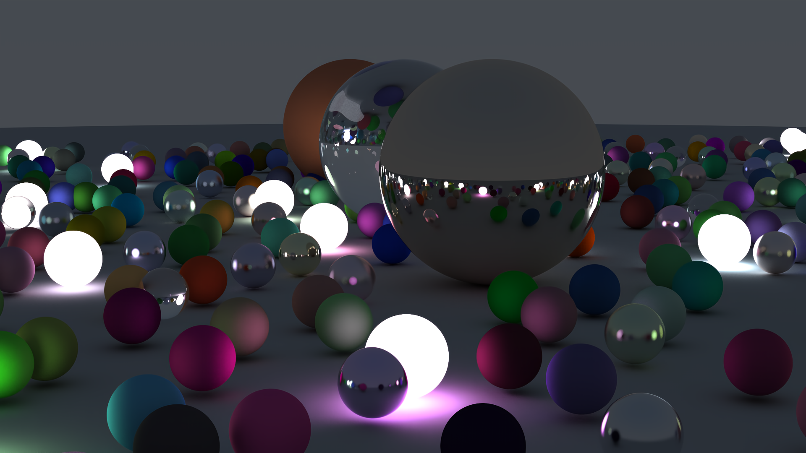

# RT Weekend

An implementation of Peter Shirley's
[Ray Tracing in One Weekend](https://raytracing.github.io/books/RayTracingInOneWeekend.html)
in Rust.



This was mostly a way for me to learn about Rust while making some pretty
pictures. Definitely has room for improvement.

Added basic [Rhai](https://rhai.rs/) scripting to describe the scenes.

## Setup

- Install [Rust](https://www.rust-lang.org/). Works with at least v1.84.0

The project is split into 2 versions: `native-rt` and `wasm-rt`. The core is in
`rt` and is used by both to run the ray tracer.

## Native

`cd` into `native-rt` and then:

### Build

I highly recommend running it in release mode. It's incredibly slow otherwise

- `cargo build --release`

### Run

Either run the target directly or do `cargo run -- <args>`

```bash
Usage: rt-weekend [OPTIONS] --scene <SCENE>

Options:
  -s, --scene <SCENE>  .rhai file describing the scene to render
  -w, --window         Output incrementally to window instead
  -h, --help           Print help
  -V, --version        Print version
```

## Web

- Install `wasm-pack` (`cargo install wasm-pack`)
- `cd` into `wasm-rt` and then:

### Build

- `npm run build`

### Run

- `npm run dev`
- Go to `http://localhost:8080`
- Hit `run`, wait

NOTE: Only one hardcoded script is available at the moment. Full list coming
laters

## Sample Scenes

See `./scenes` for example scenes. Reference images from these scenes can be
found in `./*.ref.png` files.
